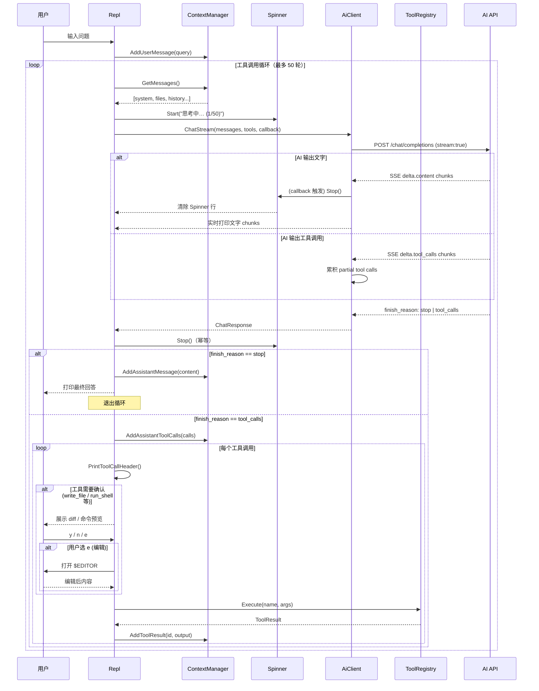
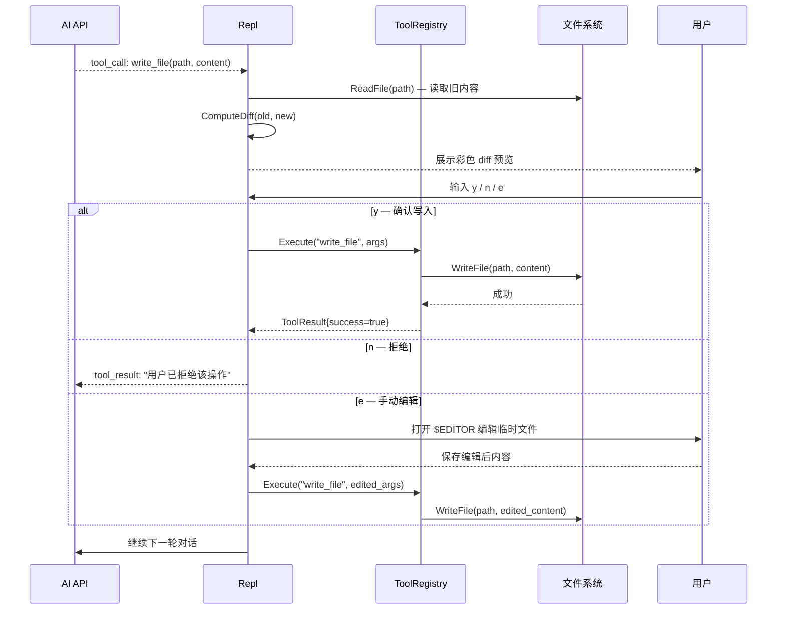

# Termind · 端脑

> 一个运行在终端里的智能代码助手，使用现代 C++17 编写。  
> 灵感来源于 Claude Code，支持自动工具调用、文件读写确认与流式输出。

```
  ████████╗███████╗██████╗ ███╗   ███╗██╗███╗   ██╗██████╗
     ██╔══╝██╔════╝██╔══██╗████╗ ████║██║████╗  ██║██╔══██╗
     ██║   █████╗  ██████╔╝██╔████╔██║██║██╔██╗ ██║██║  ██║
     ██║   ██╔══╝  ██╔══██╗██║╚██╔╝██║██║██║╚██╗██║██║  ██║
     ██║   ███████╗██║  ██║██║ ╚═╝ ██║██║██║ ╚████║██████╔╝
     ╚═╝   ╚══════╝╚═╝  ╚═╝╚═╝     ╚═╝╚═╝╚═╝  ╚═══╝╚═════╝
                     端脑 · 终端代码助手 v0.1.0 by xingxing
```

---

## 目录

- [特性](#特性)
- [快速开始](#快速开始)
- [架构](#架构)
- [时序图](#时序图)
- [内置工具（Skills）](#内置工具skills)
- [REPL 命令](#repl-命令)
- [配置](#配置)
- [构建](#构建)
- [兼容模型](#兼容模型)

---

## 特性

- 🔄 **完全 REPL 交互** — readline 历史、多行粘贴、彩色提示符
- 🤖 **自动工具调用循环** — AI 自主选择合适工具，迭代直到任务完成（最多 50 轮）
- 📖 **文件上下文注入** — `/file` 命令将代码文件送入 AI 上下文
- ✏️ **精准文件编辑** — `edit_file` 工具只替换指定片段，附带 diff 预览
- ✅ **写操作用户确认** — 所有修改文件、执行命令操作均展示预览并等待 `y/n/e`
- 🌊 **流式输出** — SSE 实时打印 AI 回复，Spinner 动画消除等待感
- 🔌 **OpenAI 兼容** — 支持 GPT-4o、Claude、本地 Ollama 等任意兼容 endpoint

---

## 快速开始

```bash
# 1. 设置 API Key（支持 OpenAI、Anthropic 或兼容 endpoint）
export TERMIND_API_KEY=sk-...
export TERMIND_MODEL=gpt-4o          # 可选，默认 gpt-4o

# 2. 构建
mkdir build && cd build
cmake .. -DCMAKE_BUILD_TYPE=Release
make -j$(nproc)

# 3. 启动
./termind
```

使用自定义 endpoint（如 Ollama 或 Claude）：

```bash
export TERMIND_API_BASE_URL=https://api.anthropic.com/v1
export TERMIND_MODEL=claude-3-7-sonnet-20250219
./termind
```

---

## 架构

```
┌─────────────────────────────────────────────────────────────────┐
│                        termind 进程                              │
│                                                                 │
│  ┌──────────┐   用户输入    ┌─────────────────────────────────┐ │
│  │          │ ──────────→  │            Repl                 │ │
│  │ readline │              │  • 斜杠命令分发                  │ │
│  │ history  │ ←──────────  │  • RunAgentLoop                 │ │
│  └──────────┘   提示符     │  • 工具确认 / diff 预览          │ │
│                            └────────────┬────────────────────┘ │
│                                         │                       │
│              ┌──────────────────────────┼──────────────┐        │
│              ↓                          ↓              ↓        │
│  ┌───────────────────┐   ┌──────────────────┐  ┌─────────────┐ │
│  │   ContextManager  │   │    AiClient      │  │ToolRegistry │ │
│  │                   │   │                  │  │             │ │
│  │ • 系统提示词       │   │ • Chat()         │  │ • Register  │ │
│  │ • 文件上下文       │   │ • ChatStream()   │  │ • Execute   │ │
│  │ • 对话历史         │   │ • SSE 流式解析   │  │ • 8 内置工具│ │
│  │ • GetMessages()   │   │ • 工具调用重建   │  │             │ │
│  └───────────────────┘   └────────┬─────────┘  └──────┬──────┘ │
│                                   │                    │        │
│                          ┌────────↓────────┐           │        │
│                          │  ConfigManager  │           │        │
│                          │                 │    ┌──────↓──────┐ │
│                          │ • API Key/URL   │    │    Tools    │ │
│                          │ • 模型/温度     │    │read_file    │ │
│                          │ • 配置文件/env  │    │write_file   │ │
│                          └─────────────────┘    │edit_file    │ │
│                                                 │list_dir     │ │
│                                ┌─────────────┐  │search_files │ │
│                                │  utils      │  │grep_code    │ │
│                                │• Spinner    │  │run_shell    │ │
│                                │• 颜色/diff  │  │get_file_info│ │
│                                │• 文件读写   │  └─────────────┘ │
│                                └─────────────┘                  │
└─────────────────────────────────────────────────────────────────┘
                                   │ libcurl
                                   ↓
                      ┌────────────────────────┐
                      │   AI API (OpenAI 兼容)  │
                      │  POST /chat/completions │
                      │  stream: true (SSE)     │
                      └────────────────────────┘
```

### 模块职责

| 模块 | 文件 | 职责 |
|------|------|------|
| `Repl` | `repl.cpp` | REPL 主循环、命令分发、工具确认流程、Spinner 协调 |
| `AiClient` | `ai_client.cpp` | libcurl HTTP 请求、SSE 流式解析、工具调用重建 |
| `ContextManager` | `context_manager.cpp` | 维护对话历史、文件上下文、构建 AI 消息列表 |
| `ToolRegistry` | `tool_registry.cpp` | 工具注册/查询/执行，8 个内置 skill |
| `ConfigManager` | `config.cpp` | 单例配置，支持文件 + 环境变量双来源 |
| `utils` | `utils.cpp` | 颜色输出、diff、Spinner 动画、文件读写、交互确认 |

---

## 时序图

### 普通对话（有工具调用）



### 文件写入确认流程



---

## 内置工具（Skills）

AI 会根据任务自动选择下列工具，循环迭代直到完成：

| 工具 | 是否需确认 | 功能 |
|------|:---:|------|
| `read_file` | ❌ | 读取文件内容，支持 `start_line`/`end_line` 行范围 |
| `write_file` | ✅ | 覆盖写入文件，执行前展示 diff 预览 |
| `edit_file` | ✅ | **精准替换**文件中某段内容（推荐小改动使用） |
| `list_directory` | ❌ | 列出目录内容，支持递归 |
| `search_files` | ❌ | 按文件名 glob 模式搜索（`*.cpp`、`test_*` 等） |
| `grep_code` | ❌ | 在代码中搜索正则，返回匹配行 + 上下文 |
| `run_shell` | ✅ | 在工作目录执行任意 shell 命令 |
| `get_file_info` | ❌ | 获取文件大小、类型、修改时间等元数据 |

> ✅ 标记的工具会在执行前展示预览并等待用户确认，支持 `y`/`n`/`e`（编辑）三种选择。

---

## REPL 命令

```
对话
  直接输入问题或指令，AI 会自动调用工具完成任务

文件操作
  /file  <路径>     将文件加入 AI 上下文（AI 可直接引用其内容）
  /files            列出当前上下文中的所有文件
  /clearfiles       清除文件上下文
  /add   <内容>     直接附加文字片段到上下文

会话管理
  /clear            清除对话历史（保留文件上下文）
  /tokens           显示预估的 token 用量

配置
  /model <名称>     切换 AI 模型（立即生效）
  /config           查看当前运行配置

目录
  /cd    <路径>     切换工作目录（工具的相对路径基准也随之更新）
  /pwd              显示当前工作目录

其他
  /help             显示帮助
  /quit             退出（自动保存 readline 历史）
```

---

## 配置

### 配置文件

路径：`~/.config/termind/config.json`

```json
{
    "api_key":             "sk-...",
    "api_base_url":        "https://api.openai.com/v1",
    "model":               "gpt-4o",
    "max_tokens":          8192,
    "temperature":         0.7,
    "stream":              true,
    "auto_approve_reads":  true,
    "max_tool_iterations": 50,
    "system_prompt":       ""
}
```

### 环境变量（优先级高于配置文件）

| 变量 | 说明 |
|------|------|
| `TERMIND_API_KEY` | API 密钥（也接受 `OPENAI_API_KEY`） |
| `TERMIND_API_BASE_URL` | API 基础地址（也接受 `OPENAI_API_BASE`） |
| `TERMIND_MODEL` | 默认模型 |
| `EDITOR` | `e` 选项打开的编辑器（默认 `vi`） |

### 命令行参数

```
./termind [选项]

  -c, --config <路径>   指定配置文件
  -m, --model  <名称>   覆盖模型
  -d, --dir    <路径>   设置工作目录
  --no-stream           禁用流式输出
  -h, --help            帮助
  -v, --version         版本
```

---

## 构建

### 依赖

| 依赖 | 版本 | 说明 |
|------|------|------|
| CMake | ≥ 3.20 | 构建系统 |
| GCC / Clang | 支持 C++17 | 编译器 |
| libcurl | 任意 | HTTP 请求 |
| readline | 任意 | REPL 输入 |
| nlohmann/json | 3.11.3 | JSON（CMake 自动下载） |

Ubuntu / Debian 安装依赖：

```bash
sudo apt install build-essential cmake libcurl4-openssl-dev libreadline-dev
```

### 编译

```bash
mkdir build && cd build

# Debug（含调试符号）
cmake .. -DCMAKE_BUILD_TYPE=Debug
make -j$(nproc)

# Release（优化）
cmake .. -DCMAKE_BUILD_TYPE=Release
make -j$(nproc)

# 安装到系统（可选）
sudo make install
```

---

## 兼容模型

| 服务 | API Base URL | 推荐模型 |
|------|-------------|---------|
| OpenAI | `https://api.openai.com/v1` | `gpt-4o` |
| Anthropic | `https://api.anthropic.com/v1` | `claude-3-7-sonnet-20250219` |
| Ollama（本地）| `http://localhost:11434/v1` | `qwen2.5-coder:32b` |
| DeepSeek | `https://api.deepseek.com/v1` | `deepseek-chat` |
| 月之暗面 | `https://api.moonshot.cn/v1` | `moonshot-v1-32k` |

---

## 许可

MIT License © 2026 xingxing
